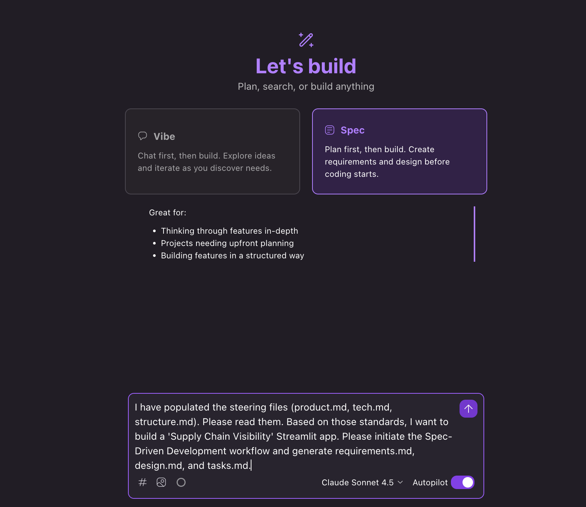

# Kiro Workshop: Supply Chain Visibility App

## What Are We Building?

A self-service Streamlit dashboard that lets business analysts explore supply chain data using plain English. Instead of writing SQL, you type questions like "Which suppliers have the worst delivery delays?" and the app responds with interactive tables and charts

---

## Workshop Overview

In this hands-on session, you'll use Kiro's Spec-Driven Development workflow to build this app from scratch using steering files and natural language prompts. Kiro will generate requirements, design, and implementation tasks — then execute them.

---

## Prerequisites

### 1. Create an AWS Builder ID

1. Go to [AWS Builder ID Sign Up](https://profile.aws.amazon.com/)
2. Click "Sign up" and follow the prompts
3. Enter your email address and create a password
4. Verify your email address through the confirmation link
5. Complete your profile information

The first time you access Kiro, you'll receive 500 bonus credits* usable within 30 days, whatever plan you sign up for, including Kiro Free.

*Learn more about [Kiro credits](#understanding-kiro-credits) below.

### 2. Download and Install Kiro

1. Go to [kiro.dev/download](https://kiro.dev/download)
2. Select your operating system (Windows, macOS, or Linux)
3. Download and install the application
4. Launch Kiro and sign in with your AWS Builder ID


## Getting Started

### Step 1: Clone the Repository
t
Open Kiro IDE, click on Clone repository and paste the below URL:


```bash
https://github.com/hsanchi/MCC-Wichita.git
```

Open the cloned folder as your workspace in Kiro.

### Step 2: Set Up Steering Files

The steering files tell Kiro about your project's standards, tech stack, and structure. Move them into the Kiro steering directory:

```bash
mkdir -p .kiro/steering && mv product.md structure.md tech.md .kiro/steering/
```

This creates three steering files:
- `product.md` — Product vision, user personas, and core principles
- `tech.md` — Tech stack (Python, Streamlit, SQLite, Bedrock) and architectural constraints
- `structure.md` — Expected project directory layout

Kiro automatically reads these on every interaction to keep generated code aligned with your standards.

### Step 3: Start Spec-Driven Development

Open the Spec panel in Kiro. For detailed instructions, see [Kiro's Getting Started Guide](https://kiro.dev/docs/getting-started/first-project/#open-your-project).



### Step 4: Enter the Prompt

Copy and paste the following prompt into the Spec input field:

```
I have populated the steering files (product.md, tech.md, structure.md). Read them. Based on those standards, I want to build a 'Supply Chain Visibility' Streamlit app.

Initiate the Spec-Driven Development workflow and generate requirements.md, design.md, and tasks.md.
```

### Step 5: Let Kiro Work

Once you submit the prompt, Kiro will:


1. Read the steering files in .kiro/steering/
2. Generate a requirements document
3. Create a design document
4. Break down the work into actionable tasks
5. Guide you through the implementation

---

## To Run the application

1. Configure AWS CLI credentials
2. Install dependencies and run app

```bash
pip3 install -r requirements.txt
```

```bash
streamlit run app.py
```

---

## What's Included

This workspace contains:

- **Steering Files:**
  - product.md - Product vision and principles
  - tech.md - Technical stack and constraints
  - structure.md - Project structure guidelines
These files guide Kiro to build applications that follow your organization's standards.


---

## Learning Objectives

By the end of this workshop, you'll understand how to:

- Use steering files to encode organizational standards
- Leverage Spec-Driven Development for complex projects
- Build data applications using natural language
- Work with Kiro's AI assistant effectively

---

## Next Steps
After completing the initial spec generation, you can:

- Iterate on the requirements
- Refine the design
- Execute the implementation tasks
- Add new features using the same workflow


## Understanding Kiro Credits

A credit is a unit of work in response to user prompts. Simple prompts can consume less than 1 credit. More complex prompts, such as executing a spec task, typically cost more than 1 credit.

Different models consume credits at different rates — a prompt executed via Sonnet 4.5 costs more credits than executing it with Auto. Credits are metered to the second decimal point (minimum 0.01 credits per task).

For more information, visit the [Kiro FAQ](https://kiro.dev/faq).

Happy building! 🚀
